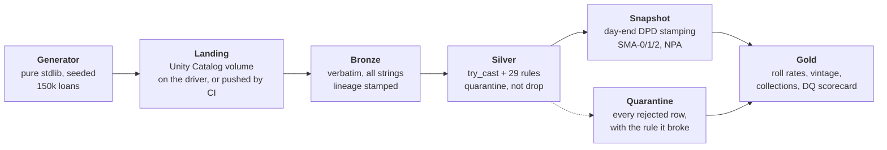

# BFSI Lending Lakehouse

Roll-rate matrices, vintage triangles, delinquency buckets and an IND-AS 109
provision for an Indian no-cost-EMI / checkout-finance book — computed twice,
independently, and calibrated against a figure the lender's rating agency
actually published.

The delivery mechanism is a medallion lakehouse in PySpark on **Databricks Free
Edition**, with a validation-rule repository modelled on how RBI return
validation works. But the analytics are the point: the pipeline exists so the
numbers have somewhere to come from.

It runs at **zero cost**, on free tiers only, and every headline number below
came out of a real run rather than an illustration.

**→ [Live dashboard](https://git-shivampatil.github.io/bfsi-lending-lakehouse/)**
— portfolio position, roll-rate matrix, vintage triangle and data-quality
scorecard, rebuilt by CI on every push.

**→ [What the book actually says](docs/ANALYSIS.md)** — the analyst's read, with
every finding labelled as a property of the portfolio, a property of the
generator, or a fact about measurement. A pipeline that produces no conclusion
is a pipeline nobody needed.

### Where each part has actually run

Being straight about this matters more than the claim it costs me:

| | |
|---|---|
| Generator, back-test, dashboard | Verified locally **and** in CI |
| Medallion pipeline (bronze → gold) | Verified in CI on PySpark **3.5.3 and 4.2.0** |
| Incremental `MERGE INTO`, Delta time travel | Verified in CI (needs a Delta runtime) |
| Databricks Free Edition | **Run end to end on 2026-09-05**, from a Git folder, on serverless. Figures below. |
| The deployment bundle | Schema-valid and serverless-clean in CI on every push. **Not yet deployed** — see the caveat below. |

**What the Databricks run produced.** [`notebooks/run_pipeline.py`](notebooks/run_pipeline.py)
executed top to bottom against `workspace.default`: the generator on the driver
(pure standard library, nothing installed), then bronze → silver → snapshot →
gold.

| | |
|---|---|
| Bronze rows landed | 1,400 · 105,000 · 150,000 · 1,124,484 · **810,475** |
| Gold tables built | 8 — portfolio 24, bucket mix 113, roll rate 373, vintage 300, collections 36, merchant risk 1,400, ECL staging 68, DQ scorecard 9 |
| GNPA at 2026-08-31, CRISIL basis | **1.907%** |
| GNPA at 2026-08-31, on the surviving book | **0.733%** |
| Live loans / principal outstanding | 62,503 · ₹53.62 crore |

The bronze count reconciles exactly, which is the check worth making: the
generator emitted 807,166 repayment attempts and deliberately injected 3,309
duplicate keys, and 807,166 + 3,309 = 810,475. The quarantine reconciles the
same way — 3,309 findings for the duplicate-key rule, 2,980 for the EMI
reconciliation break, 305 for out-of-domain bureau scores, each equal to the
number injected.

**Two things that had to be fixed before any of it ran**, both invisible to CI
because CI runs open-source Spark on a local master where both work:

- `clean.py` cached the cleaned frame. The DataFrame and SQL caching APIs raise
  on serverless compute, which is all Free Edition has.
- `ingest.py` stamped lineage with `input_file_name()`, removed in DBR 17.3 LTS.
  The supported replacement is the hidden `_metadata` column.

**What is still not proven.** The bundle in [`databricks.yml`](databricks.yml)
has never been deployed — it is checked against the CLI's own JSON schema on
every push, which catches a malformed task or a cluster block serverless would
reject, but schema-valid is not deployable. The run above was driven from a Git
folder and a notebook, not from `databricks bundle deploy`.

---

## What it does



Data reaches the lakehouse **by being put there, never by being fetched**, and
that is a constraint rather than a preference. Databricks Free Edition has no
account console — so there is no way to create the storage credential that a
Unity Catalog external location requires, and the workspace therefore cannot
read an external S3 bucket at all. "S3 is the lake, Databricks queries it" is
not buildable here.

Two ways in, then. The run on 2026-09-05 used the first:

- **On the driver.** The generator has no third-party dependencies, so it runs
  inside the workspace and writes straight into the volume. Nothing to upload,
  no token, no secret.
- **Pushed from CI.** [`.github/workflows/databricks.yml`](.github/workflows/databricks.yml)
  generates the book on a GitHub runner and sends it through the Files API,
  which is the path a real pipeline with a real upstream would take.

See [Cost](#cost-actually-zero).

---

## Results from the shipped configuration

`--loans 150000 --months 24 --seed 42 --as-of 2026-08-31`

| | |
|---|---|
| Loans / customers / merchants | 150,000 · 105,000 · 1,400 |
| EMI schedule rows | 1,124,484 |
| Repayment attempts | 816,928 |
| Raw extract size | 128 MB CSV |
| Generation time | **64 s** on a 2-core i3, no third-party dependency |
| Independent back-test | 43 s |
| Open loans at as-of | 63,137 |
| Principal outstanding | ₹13.16 crore |
| Average ticket | ₹3,512 |
| Written off (>180 DPD) | 3,888 loans, of which 3,355 in the last 12 months |

**Portfolio position at 2026-08-31**

| Bucket | Share of book by value | Loans |
|---|---:|---:|
| Current | 94.91% | 59,923 |
| 1–30 DPD (SMA-0) | 1.59% | 846 |
| 31–60 DPD (SMA-1) | 1.06% | 605 |
| 61–90 DPD (SMA-2) | 0.61% | 412 |
| 90+ DPD (NPA) | **1.84%** | 1,351 |

Median monthly collection efficiency **97.4%**, bounce rate **3.4%** of attempts.

### Why those numbers are the right ones

The book is calibrated against a published figure, not tuned until it looked
plausible: CRISIL's April 2026 rating rationale for Snapmint Financial Services
Pvt Ltd reports **GNPA of 2.0%** as at 31 Dec 2025. The generator targets it and
CI fails the build if it drifts more than 60 bps:

```
GNPA (90+ DPD over gross advances) 1.838% vs target 2.000%
  (tolerance +/-0.600%) -> drift 0.162%
Average ticket Rs 3,512 vs published Rs 3,500 (tolerance +/-Rs 400) -> drift Rs 12
90+ incl. trailing-12m write-offs / trailing-12m disbursements 2.237%
  (CRISIL reports 2.7% at 31 Dec 2025 on its own denominator)
```

#### Reading the source is half the work

The rationale contains **two different ratios**, and this project got the
distinction wrong in both directions before settling it against the primary
source.

What it says plainly is *"Its GNPA improved from ~3.1% as on March 31, 2025, to
~2.0% as on December 31, 2025"* — an ordinary gross NPA, 90+ DPD over gross
advances. That is what the build gates on.

Elsewhere in the same document is a second metric: **"90+ dpd including last 12
months write-offs / Disbursements"**, at 2.7% (Dec 25), 4.8% (Mar 25) and 6.3%
(Mar 24). Its denominator is *disbursements*, not advances, which makes it a
loss rate on origination rather than a GNPA at all.

For one commit this repository read the second as a definitional gloss on the
first, folded write-offs into a gross-advances denominator, and recalibrated to
match — producing a ratio belonging to neither and a book roughly three times too
clean. The fix was to go back and read the sentence. The supplementary ratio is
now computed and reported beside the GNPA, on a trailing-twelve-month
denominator with that choice stated, because "Disbursements" over a nine-month
reporting period is genuinely ambiguous from outside the company. It is reported,
not matched to a target.

The same care applies to the ticket figure. *"Average ticket size ranging from
Rs 3,500 to Rs 25,000"* is a range **across products**; *"As of December 31,
2025, the average ticket size for the overall portfolio was Rs 3,500"* is the
portfolio mean, and it is the one a book-level average has to hit. Reading the
first as a band the mean may sit anywhere inside let this book run four times too
large. Arithmetic settles it independently of the wording: at ₹3,500 the
published disbursement series implies about 10.2 million loans, consistent with
CRISIL's "15+ million transactions"; at ₹14,604 it implies 2.4 million, which
cannot be reconciled with the same document.

Beyond the definitions, holding the target across seeds took three modelling
corrections that a naive generator gets wrong, and each one is a real property
of a lending book:

1. **The book has to grow.** With a fixed loan count spread over 24 months,
   short-tenure loans mature and close while defaults persist, the denominator
   collapses, and GNPA drifts up without limit. The first version of this
   generator produced **24.9%**.
2. **Write-offs have to leave the book.** Accounts past 180 DPD are excluded
   from gross advances; without that rule, losses are counted twice and GNPA
   drifts up without limit.
3. **Vintage curves have to be cumulative and measured at equal months-on-book.**
   More on that below — it is the subtlest of the three.

A second published anchor guards the ticket distribution: the build fails if the
generated mean drifts more than ₹400 from the published ₹3,500. The
distribution's *shape* is still an assumption; the mean it has to hit is not.
Ticket size does not enter the hazard function, so the two gates are independent
and can be tuned one at a time.

---

## The two parts that are actually hard

### Vintage curves

A vintage curve compares disbursal cohorts at **equal months-on-book**. Reading
each cohort "as at today" compares a three-month-old book against a two-year-old
one and produces a slope caused purely by age.

It must also be **cumulative** — *ever* 30+ by MOB *m*, not *at* 30+ at MOB *m*.
The point-in-time version falls whenever accounts cure, so cohorts appear to
improve as they season.

The trap underneath both: a naive `MAX(...) OVER (PARTITION BY loan_id)` over
surviving snapshot rows still produces a curve that slopes downwards, because a
loan that went delinquent and then closed silently leaves *both* the numerator
and the denominator. The fix is to reduce each loan to the MOB at which it first
breached, then hold the cohort denominator fixed — see
[`VINTAGE_SQL`](pipeline/gold/metrics.py). A test asserts monotonicity, and it
caught exactly this bug during development.

### Roll rates

"Of the accounts in bucket X at month end, where were they a month later." It is
a self-join in disguise, but `LEAD` over a per-loan window is both faster and
safer: a self-join on a date offset silently drops loans whose next snapshot is
missing, whereas `LEAD` makes that a `NULL` you have to account for.

That `NULL` then has to be split, which is the part this got wrong at first.
There are **three** ways to leave a bucket, not two:

- `WRITTEN_OFF` — crossed 180 DPD and was taken as a loss;
- `CLOSED` — repaid in full and left the book;
- a bucket — rolled, cured, or stayed put.

The first version called both exits `CLOSED`, which reports a write-off as
though it were a successful payoff. That flatters the cure rate and hides
exactly the number a credit committee is looking for. An account already written
off is also no longer a valid *origin* — it has left the book and cannot roll
anywhere.

---

## The validation layer

29 rules across 5 entities — 22 rejecting, 7 warning — held as **configuration rather than code** in
[`validation/rules.py`](validation/rules.py), so the rule set can be reviewed by
someone who does not read PySpark. Each rule carries a data-quality dimension —
Accuracy, Completeness, Timeliness, Consistency — which is the ACTC framing RBI
uses in its Supervisory Data Quality Index.

Three ideas borrowed from how regulatory return validation genuinely works:

- **Element-level and cross-element checks are different things.** A value can be
  individually valid and still contradict another field (`emi_amount` ≠
  `principal_component + interest_component`) or another entity (a repayment
  whose `loan_id` is not on the loan master).
- **Severity matters.** `REJECT` quarantines the row; `WARN` lets it through and
  counts it. A lender that dropped every customer with a missing pincode would
  understate its own book.
- **Nothing is dropped silently.** Rejected rows go to a quarantine table tagged
  with the rule they broke. An unexplained row-count gap between bronze and
  silver is what destroys trust in a pipeline.

The generator **injects defects on purpose** at known rates — duplicate
repayment keys, orphan foreign keys, future-dated payments, reconciliation
breaks, mojibake, out-of-domain bureau scores — so the validation layer is scored
against a ground truth instead of grading its own homework. A test asserts that
every defect type actually appears at the fixture size; two of them originally
did not, which meant the rules guarding them were passing vacuously.

---

## Incremental loads, and the trap inside `MERGE INTO`

A lakehouse that only ever overwrites is a batch job with extra steps.
[`pipeline/silver/upsert.py`](pipeline/silver/upsert.py) is the incremental
path: batches append to bronze and merge into silver on a natural key.

`MERGE INTO` requires at most one source row per target row. Give it a source
with a duplicated key and Delta **refuses**:

```
Cannot perform Merge as multiple source rows matched ...
```

That is Delta refusing a non-deterministic write, and the fix is not to disable
the check — it is to collapse duplicates with an explicit, stable ordering
*before* merging, which is what `apply_uniqueness` does. The tests assert both
halves: that an un-deduplicated source really does fail, and that the pipeline's
own output really does not. Plus idempotency (replaying a batch must not change
the table), in-place correction of restated rows, and that Delta history records
every write.

## Expected credit loss

[`ECL_SQL`](pipeline/gold/metrics.py) stages the book under IND-AS 109 —
Stage 1 (≤30 DPD, 12-month ECL), Stage 2 (31–90, lifetime), Stage 3 (90+,
credit-impaired) — and computes a provision as EAD × PD × LGD. Tests assert the
staging partitions the book exactly once and that coverage rises with stage.

The PD and LGD inputs are **assumptions and the weakest numbers in the repo**: a
real implementation derives PD from the observed roll-rate matrix and LGD from
realised recoveries, neither of which this book models. The staging is real; the
provision figure has the right shape but is not quotable.

## The SQL exercises

[`exercises/`](exercises/) is a set of lending analytics questions over these
same silver tables, each built around a trap that returns a **plausible wrong
answer** rather than an error — a query that fails loudly teaches nothing, and
the ones worth testing are the ones that quietly report 0% first-payment
default.

Each ships three files: the answer, the naive version, and a fixture holding a
small input plus the expected output **computed by hand**. The suite asserts
both that the answer matches the oracle *and* that the naive version does not —
without the second assertion there is no evidence the fixture is even big
enough to tell them apart.

| | The trap |
|---|---|
| GNPA and PAR by month | A conditional `SUM` over a month with no NPA is NULL, not 0, so clean months read as missing. Was live in this repo's own gold layer. |
| Running collections | The default window frame is `RANGE`, not `ROWS`. Two payments dated the same day both report the day's closing total. |
| First-payment default by merchant | `NOT IN` against a subquery holding one NULL returns **no rows** — a clean-looking 0% FPD across the book. |
| Reconciling a replay | `EXCEPT` de-duplicates, so the duplicated row indicating a non-idempotent write compares equal and vanishes. |
| Longest delinquency streak | The row-number-difference island technique welds two spells into one when a month's snapshot is *missing* rather than merely clean. |

`QUALIFY` is probed for at session start rather than assumed — it is in the
Spark 4.2 grammar and absent from 3.5, and CI runs both. The fixtures are tens
of rows: they prove semantics, not performance, and
[`exercises/README.md`](exercises/README.md) says so before it says anything
else.

## Correctness

The Spark pipeline and [`validation/backtest.py`](validation/backtest.py)
implement the same definitions **twice, independently** — the second in a few
hundred lines of pure Python over the same CSVs. They are required to agree:

```python
assert spark_gnpa == pytest.approx(python_gnpa, abs=0.002)
```

Two implementations agreeing is much stronger evidence than one implementation
passing its own assertions. **40 tests**, all green, covering determinism,
amortisation reconciliation, ANSI-mode `try_cast` behaviour, rule compilation,
quarantine correctness, snapshot reproducibility for historical dates, roll-rate
closure, vintage monotonicity, ECL staging completeness, Delta idempotency, both
published calibration gates, and cross-implementation parity on GNPA.

A third oracle sits alongside those: the [SQL exercises](exercises/) are checked
against expected outputs computed by hand, and each one also asserts that the
*naive* query disagrees with them. Between the three, every definition in this
repository is stated at least twice and the two statements are required to
match.

---

## Run it

Nothing beyond Python 3.9+ is needed for the data itself:

```bash
python -m generator --loans 150000 --months 24 --seed 42 --as-of 2026-08-31 --out data/raw
python -m validation.backtest --data data/raw --as-of 2026-08-31 --strict
```

The dashboard needs nothing either:

```bash
python -m docs.build_dashboard --data data/raw --as-of 2026-08-31 --out docs/index.html
```

The pipeline needs PySpark. The Delta tests additionally need a Hadoop runtime,
so they skip on Windows and run on Linux:

```bash
pip install pyspark delta-spark pytest
python -m pytest tests/ -q -m "not delta"   # everywhere
python -m pytest tests/ -q -m delta         # Linux / CI
```

### On Databricks Free Edition

This is the path that was actually walked on 2026-09-05, and it needs no
credentials anywhere — the repository is public, so the Git folder clones
without auth, and the generator runs on the driver rather than the data being
uploaded:

1. Sign up at **databricks.com/learn/free-edition**. Not the *free trial* —
   that is a different product, it is 14 days, and it converts to
   pay-as-you-go. Free Edition has no payment method attached at all.
2. **Workspace → Create → Git folder**, pointed at this repository. GitHub is
   detected automatically.
3. Open `notebooks/run_pipeline.py` and **Run all**. The first cell creates the
   landing volume in `workspace.default`; the rest is bronze → silver →
   snapshot → gold.

Nothing is installed on the cluster. Serverless is explicit that installing
PySpark, or anything depending on it, terminates the session — which the
generator sidesteps by having no third-party dependencies at all.

To drive it from CI instead, [`.github/workflows/databricks.yml`](.github/workflows/databricks.yml)
generates the book on a runner and pushes it into the volume through the Files
API. That path needs a personal access token in repository secrets, because
Free Edition has no account console and therefore no service principals and no
OAuth machine-to-machine.

Or run the stages directly, which is what the job tasks do:

```bash
python jobs/run_stage.py --stage bronze   --reporting-date 2026-08-31
python jobs/run_stage.py --stage silver   --reporting-date 2026-08-31
python jobs/run_stage.py --stage snapshot --window-start 2024-09-30 --reporting-date 2026-08-31
python jobs/run_stage.py --stage gold
```

---

## Cost: actually zero

| Component | Tier used | Why it stays free |
|---|---|---|
| Compute + storage | Databricks **Free Edition** | Perpetually free, serverless. Replaced Community Edition, retired 1 Jan 2026. |
| CI | GitHub Actions | Free for public repos on standard runners. |
| Object storage | Optional, S3-compatible | Not required — the landing zone is a Unity Catalog volume. |

Free Edition's limits shape the design: one 2X-Small SQL warehouse, 5 concurrent
job tasks, one active pipeline per type, **Spark Connect APIs only — no RDD
APIs**, no Scala, no JARs, no Maven coordinates, no init scripts, DBFS disabled.
The project stays inside a 1–5 GB, 10–50M row envelope and makes no TB-scale
claim. Exceeding the daily quota stops compute for the rest of the day; it does
not delete anything.

Two constraints that changed the architecture rather than merely annoying it:

- **The workspace cannot read an external S3 bucket.** Not because a document
  forbids it, but because Free Edition has no account console — so there is no
  way to create the storage credential a Unity Catalog external location
  requires. "S3 is the lake, Databricks queries it" is not buildable here, and
  the landing zone is a managed volume that data is *pushed* into.
- **No dashboard can be shared publicly.** No edition of Databricks offers
  anonymous access to a published dashboard, and Free Edition has one account
  with no SSO or SCIM, so there is nobody to share to. That is why the public
  artefact is a GitHub Pages page built by CI, not a Databricks dashboard link.

And one trap worth naming, because it bills silently: the Databricks **Free
Trial** is not Free Edition. It is 14 days, and when the credits run out or day
15 arrives the account converts to pay-as-you-go — via AWS Marketplace, against
the payment method on the AWS account. Free Edition has no payment method
attached at all. The two signup doors look nearly identical and both say "free".

---

## What is real and what is not

Being precise about this is the point of the project, not a disclaimer.

**Sourced, with references in [`generator/config.py`](generator/config.py):** the
2.0% GNPA target (CRISIL, Snapmint Financial Services Pvt Ltd, 16 Apr 2026);
RBI SMA-0/1/2 day-count bands and the day-end stamping rule from the IRACP
clarification of 12 Nov 2021; the 5% Default Loss Guarantee cap from the RBI
(Digital Lending) Directions, 2025.

**Assumptions, labelled as such:** ticket-size distribution, bureau-band mix and
their PD multipliers, cure rates by bucket, festive seasonality, merchant
category mix, bounce-reason weights. Snapmint publishes no average ticket size,
so none is claimed.

**Entirely synthetic:** every customer, merchant, loan and repayment. No real
lending data is used, and none of it is scraped from anywhere.

## Limitations, and what I would do differently

- **Roll rates are computed on month-end snapshots**, so an account that goes
  delinquent and cures within a single month is invisible. A daily grain would
  catch it; at 24 months × 150k loans that is ~100× the rows for a question this
  book does not need to answer. `--daily-tail` stamps a recent window for
  exactly that reason.
- **The cure model is memoryless.** Real accounts that have rolled twice behave
  differently from first-time delinquents; a state-dependent cure probability
  would produce a more realistic roll-rate matrix.
- **ECL staging keys off DPD alone.** A real implementation also stages on
  qualitative triggers — restructuring, forbearance, watch-list — and on
  relative PD deterioration since origination, not only an absolute day count.
- **No Default Loss Guarantee modelling.** The RBI (Digital Lending) Directions,
  2025 cap DLG at 5% of the disbursed portfolio, but this book has no lending
  service provider and no guarantee arrangement, so there is nothing honest to
  compute. A constant for the cap was removed rather than given an invented use.
- **No streaming path.** Everything is batch. A CDC feed via Debezium into a
  bronze append would be closer to how a real lender ingests.
- **The `_corrupt_record` column is dropped after silver** rather than being
  retained for forensics. It should be kept with the quarantine.
- **The bounce rate is not really a bounce rate.** It reads 3.4% of attempts,
  where NACH debit returns across the Indian industry run far higher. The
  model's hazard is the probability of *entering delinquency*, not of a single
  failed presentation — a bounce that cures within the same cycle is never
  emitted at all. The column name promises more than the model delivers.
  Modelling presentation-level retries separately from delinquency entry is the
  fix, and it would also give first-payment default an independent mechanism,
  which [the analysis](docs/ANALYSIS.md) shows it currently lacks.
- **Bounce reasons are sampled independently of collection mode**, so a
  `SIGNATURE_MISMATCH` can be returned against a UPI autopay mandate. Harmless
  to every metric computed here, and obviously wrong to anyone who has worked a
  collections queue.
- **The bundle has never been deployed.** It is schema-checked on every push
  and it is written to the serverless constraints, but the end-to-end run went
  through a Git folder and a notebook.
- **Several segment cuts have no statistical power.** The configured city-tier
  risk gradient is 14%, and at 150k loans that is about two standard errors —
  the observed ordering does not match the configured one. Any conclusion drawn
  from a segment cut on a book this size needs the arithmetic done first, which
  is why the analysis document does it out loud.
