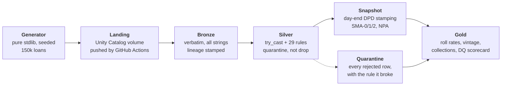

# BFSI Lending Lakehouse

A medallion-architecture lakehouse for an Indian no-cost-EMI / checkout-finance
lender, written in PySpark for **Databricks Free Edition**, with a
regulatory-grade gold layer and a configurable validation-rule repository
modelled on how RBI return validation actually works.

It runs at **zero cost**, on free tiers only, and every headline number below
came out of a real run rather than an illustration.

**→ [Live dashboard](https://git-shivampatil.github.io/bfsi-lending-lakehouse/)**
— portfolio position, roll-rate matrix, vintage triangle and data-quality
scorecard, rebuilt by CI on every push.

### Where each part has actually run

Being straight about this matters more than the claim it costs me:

| | |
|---|---|
| Generator, back-test, dashboard | Verified locally **and** in CI |
| Medallion pipeline (bronze → gold) | Verified in CI on PySpark **3.5.3 and 4.2.0** |
| Incremental `MERGE INTO`, Delta time travel | Verified in CI (needs a Delta runtime) |
| Databricks Free Edition | **Not yet run there.** The code targets its constraints and [`notebooks/run_pipeline.py`](notebooks/run_pipeline.py) is the runbook, but no cell of it has executed on Databricks. |

The last row is the honest gap. Everything is written against Free Edition's
documented limits — serverless-only, Spark Connect APIs, no RDDs, no Scala, no
JARs — and nothing in the pipeline needs a feature outside them, but "targets"
is not "has run", and the README says so until it has.

---

## What it does



The pipeline is **push-based, not pull-based**, and that is a constraint rather
than a preference: Databricks Free Edition is serverless-only and restricts
outbound network access to an unpublished allowlist, so a workspace cannot read
an external S3 bucket. GitHub Actions does the fetching and pushes into a Unity
Catalog volume through the Files API. See [Cost](#cost-actually-zero).

---

## Results from the shipped configuration

`--loans 150000 --months 24 --seed 42 --as-of 2026-08-31`

| | |
|---|---|
| Loans / customers / merchants | 150,000 · 105,000 · 1,400 |
| EMI schedule rows | 1,124,484 |
| Repayment attempts | 816,928 |
| Raw extract size | 131 MB CSV |
| Generation time | **52 s**, no third-party dependency |
| Independent back-test | 32 s |
| Open loans at as-of | 63,137 |
| Principal outstanding | ₹54.99 crore |
| Written off (>180 DPD) | 3,888 loans |

**Portfolio position at 2026-08-31**

| Bucket | Share of book by value | Loans |
|---|---:|---:|
| Current | 94.91% | 59,923 |
| 1–30 DPD (SMA-0) | 1.59% | 846 |
| 31–60 DPD (SMA-1) | 1.06% | 605 |
| 61–90 DPD (SMA-2) | 0.61% | 412 |
| 90+ DPD (NPA) | **1.84%** | 1,351 |

Median monthly collection efficiency **97.4%**, bounce rate **3.4%** of attempts.

### Why those numbers are the right ones

The book is calibrated against a published figure, not tuned until it looked
plausible: CRISIL's April 2026 rating rationale for Snapmint Financial Services
Pvt Ltd reports **GNPA of 2.0%** as at 31 Dec 2025. The generator targets it and
CI fails the build if it drifts more than 60 bps:

```
GNPA 1.838% vs target 2.000% (tolerance +/-0.600%) -> drift 0.162%
```

Holding that across seeds took three modelling corrections that a naive
generator gets wrong, and each one is a real property of a lending book:

1. **The book has to grow.** With a fixed loan count spread over 24 months,
   short-tenure loans mature and close while defaults persist, the denominator
   collapses, and GNPA drifts up without limit. The first version of this
   generator produced **24.9%**.
2. **Write-offs have to leave the book.** Accounts past 180 DPD are written off
   and excluded from gross advances; without that rule, losses are counted twice.
3. **Vintage curves have to be cumulative and measured at equal months-on-book.**
   More on that below — it is the subtlest of the three.

---

## The two parts that are actually hard

### Vintage curves

A vintage curve compares disbursal cohorts at **equal months-on-book**. Reading
each cohort "as at today" compares a three-month-old book against a two-year-old
one and produces a slope caused purely by age.

It must also be **cumulative** — *ever* 30+ by MOB *m*, not *at* 30+ at MOB *m*.
The point-in-time version falls whenever accounts cure, so cohorts appear to
improve as they season.

The trap underneath both: a naive `MAX(...) OVER (PARTITION BY loan_id)` over
surviving snapshot rows still produces a curve that slopes downwards, because a
loan that went delinquent and then closed silently leaves *both* the numerator
and the denominator. The fix is to reduce each loan to the MOB at which it first
breached, then hold the cohort denominator fixed — see
[`VINTAGE_SQL`](pipeline/gold/metrics.py). A test asserts monotonicity, and it
caught exactly this bug during development.

### Roll rates

"Of the accounts in bucket X at month end, where were they a month later." It is
a self-join in disguise, but `LEAD` over a per-loan window is both faster and
safer: a self-join on a date offset silently drops loans whose next snapshot is
missing, whereas `LEAD` makes that a `NULL` you have to account for. Loans with
no following snapshot have **closed**, not rolled to current — folding them into
`CURRENT` would flatter the cure rate.

---

## The validation layer

29 rules across 5 entities — 22 rejecting, 7 warning — held as **configuration rather than code** in
[`validation/rules.py`](validation/rules.py), so the rule set can be reviewed by
someone who does not read PySpark. Each rule carries a data-quality dimension —
Accuracy, Completeness, Timeliness, Consistency — which is the ACTC framing RBI
uses in its Supervisory Data Quality Index.

Three ideas borrowed from how regulatory return validation genuinely works:

- **Element-level and cross-element checks are different things.** A value can be
  individually valid and still contradict another field (`emi_amount` ≠
  `principal_component + interest_component`) or another entity (a repayment
  whose `loan_id` is not on the loan master).
- **Severity matters.** `REJECT` quarantines the row; `WARN` lets it through and
  counts it. A lender that dropped every customer with a missing pincode would
  understate its own book.
- **Nothing is dropped silently.** Rejected rows go to a quarantine table tagged
  with the rule they broke. An unexplained row-count gap between bronze and
  silver is what destroys trust in a pipeline.

The generator **injects defects on purpose** at known rates — duplicate
repayment keys, orphan foreign keys, future-dated payments, reconciliation
breaks, mojibake, out-of-domain bureau scores — so the validation layer is scored
against a ground truth instead of grading its own homework. A test asserts that
every defect type actually appears at the fixture size; two of them originally
did not, which meant the rules guarding them were passing vacuously.

---

## Incremental loads, and the trap inside `MERGE INTO`

A lakehouse that only ever overwrites is a batch job with extra steps.
[`pipeline/silver/upsert.py`](pipeline/silver/upsert.py) is the incremental
path: batches append to bronze and merge into silver on a natural key.

`MERGE INTO` requires at most one source row per target row. Give it a source
with a duplicated key and Delta **refuses**:

```
Cannot perform Merge as multiple source rows matched ...
```

That is Delta refusing a non-deterministic write, and the fix is not to disable
the check — it is to collapse duplicates with an explicit, stable ordering
*before* merging, which is what `apply_uniqueness` does. The tests assert both
halves: that an un-deduplicated source really does fail, and that the pipeline's
own output really does not. Plus idempotency (replaying a batch must not change
the table), in-place correction of restated rows, and that Delta history records
every write.

## Expected credit loss

[`ECL_SQL`](pipeline/gold/metrics.py) stages the book under IND-AS 109 —
Stage 1 (≤30 DPD, 12-month ECL), Stage 2 (31–90, lifetime), Stage 3 (90+,
credit-impaired) — and computes a provision as EAD × PD × LGD. Tests assert the
staging partitions the book exactly once and that coverage rises with stage.

The PD and LGD inputs are **assumptions and the weakest numbers in the repo**: a
real implementation derives PD from the observed roll-rate matrix and LGD from
realised recoveries, neither of which this book models. The staging is real; the
provision figure has the right shape but is not quotable.

## Correctness

The Spark pipeline and [`validation/backtest.py`](validation/backtest.py)
implement the same definitions **twice, independently** — the second in a few
hundred lines of pure Python over the same CSVs. They are required to agree:

```python
assert spark_gnpa == pytest.approx(python_gnpa, abs=0.002)
```

Two implementations agreeing is much stronger evidence than one implementation
passing its own assertions. **29 tests**, all green, covering determinism,
amortisation reconciliation, ANSI-mode `try_cast` behaviour, rule compilation,
quarantine correctness, snapshot reproducibility for historical dates, roll-rate
closure, vintage monotonicity, ECL staging completeness, Delta idempotency, and
cross-implementation parity.

---

## Run it

Nothing beyond Python 3.9+ is needed for the data itself:

```bash
python -m generator --loans 150000 --months 24 --seed 42 --as-of 2026-08-31 --out data/raw
python -m validation.backtest --data data/raw --as-of 2026-08-31 --strict
```

The dashboard needs nothing either:

```bash
python -m docs.build_dashboard --data data/raw --as-of 2026-08-31 --out docs/index.html
```

The pipeline needs PySpark. The Delta tests additionally need a Hadoop runtime,
so they skip on Windows and run on Linux:

```bash
pip install pyspark delta-spark pytest
python -m pytest tests/ -q -m "not delta"   # everywhere
python -m pytest tests/ -q -m delta         # Linux / CI
```

On Databricks, run bronze → silver → snapshot → gold in order:

```bash
python -m pipeline.bronze.ingest   --batch-id 2026-08-31 --generator-version 1.0.0
python -m pipeline.silver.clean    --reporting-date 2026-08-31
python -m pipeline.silver.snapshot --start 2024-09-30 --end 2026-08-31
python -m pipeline.gold.metrics
```

---

## Cost: actually zero

| Component | Tier used | Why it stays free |
|---|---|---|
| Compute + storage | Databricks **Free Edition** | Perpetually free, serverless. Replaced Community Edition, retired 1 Jan 2026. |
| CI | GitHub Actions | Free for public repos on standard runners. |
| Object storage | Optional, S3-compatible | Not required — the landing zone is a Unity Catalog volume. |

Free Edition's limits shape the design: one 2X-Small SQL warehouse, 5 concurrent
job tasks, one active pipeline per type, **Spark Connect APIs only — no RDD
APIs**, no Scala, no JARs, no Maven coordinates. The project stays inside a
1–5 GB, 10–50M row envelope and makes no TB-scale claim.

Two traps worth naming, because both bill silently:

- The Databricks **Free Trial** is not Free Edition. Attached to your own cloud
  account it still bills you for the underlying compute and storage.
- **AWS changed its free tier on 15 July 2025** to a credit model. On the Free
  plan the account closes after six months and the data is deleted 90 days
  later. Accounts created before that date keep the legacy 5 GB S3 allowance.

---

## What is real and what is not

Being precise about this is the point of the project, not a disclaimer.

**Sourced, with references in [`generator/config.py`](generator/config.py):** the
2.0% GNPA target (CRISIL, Snapmint Financial Services Pvt Ltd, 16 Apr 2026);
RBI SMA-0/1/2 day-count bands and the day-end stamping rule from the IRACP
clarification of 12 Nov 2021; the 5% Default Loss Guarantee cap from the RBI
(Digital Lending) Directions, 2025.

**Assumptions, labelled as such:** ticket-size distribution, bureau-band mix and
their PD multipliers, cure rates by bucket, festive seasonality, merchant
category mix, bounce-reason weights. Snapmint publishes no average ticket size,
so none is claimed.

**Entirely synthetic:** every customer, merchant, loan and repayment. No real
lending data is used, and none of it is scraped from anywhere.

## Limitations, and what I would do differently

- **Roll rates are computed on month-end snapshots**, so an account that goes
  delinquent and cures within a single month is invisible. A daily grain would
  catch it; at 24 months × 150k loans that is ~100× the rows for a question this
  book does not need to answer. `--daily-tail` stamps a recent window for
  exactly that reason.
- **The cure model is memoryless.** Real accounts that have rolled twice behave
  differently from first-time delinquents; a state-dependent cure probability
  would produce a more realistic roll-rate matrix.
- **ECL staging keys off DPD alone.** A real implementation also stages on
  qualitative triggers — restructuring, forbearance, watch-list — and on
  relative PD deterioration since origination, not only an absolute day count.
- **No Default Loss Guarantee modelling.** The RBI (Digital Lending) Directions,
  2025 cap DLG at 5% of the disbursed portfolio, but this book has no lending
  service provider and no guarantee arrangement, so there is nothing honest to
  compute. A constant for the cap was removed rather than given an invented use.
- **No streaming path.** Everything is batch. A CDC feed via Debezium into a
  bronze append would be closer to how a real lender ingests.
- **The `_corrupt_record` column is dropped after silver** rather than being
  retained for forensics. It should be kept with the quarantine.
